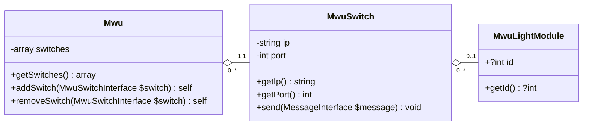

# MWU SDK
MWU SDK is a PHP library for easy communication with the [MWU system distributed by Pick to light](https://web.archive.org/web/20240927094057/https://www.picktolightsystems.com/en/series-products/mwu-series).

## Compatibility
| MWU SDK version | Implemented TCP-IP Command Reference |  
| `^1.0.0`        | `6.1`                                |

## Getting started

### Defining a default configuration

#### YAML configuration file

##### Example of complete configuration
```yaml
mwu_default_config:
  switches:
    - ip_address: "144.56.46.30"
      port: 5003
      light_modules_generator:
        first_module_number: 1
        increment_between_module_numbers: 1
        number_of_modules: 4
    - ip_address: "144.56.46.31"
      port: 5003
      light_modules_generator:
        first_module_id: 1
        increment_between_module_ids: 1
        number_of_modules: 4
  behavior:
    display_status:
      light:
        mode: on
        color: yellow
      screen:
        mode: on
        text: 0000
    display_status_after_confirm:
      light:
        mode: on
        color: green
      screen:
        mode: on
        text: 0000
    display_status_after_fn:
      light:
        mode: fast_flash
        color: red
      screen:
        mode: on
        text: 9999
    buttons:
      confirm:
        enabled: true
      fn:
        enabled: true
        text: ----
        used_as_decrement: false
      quantity_keys:
        mode: off
```

##### Retrieving the YAML configuration
To load the YAML configuration file, use the `parseConfigurationFile(string $path)` method of the `MwuSdk\SerializerDefaultConfiguration\Formats\YamlConfigurationDeserializer` class.

#### Mwu client creation, with default configuration

The default configuration is defined during instantiation of the Mwu client, which serves as the entry point for communication with the MWU system.

```php
// Instantiation of the MwuFactory (or use Symfony Dependency Injection)
// $mwuFactory = new MwuFactory(...);

$mwuClient = $mwuFactory->create($mwuConfig); // avec $mwuConfig une intance de MwuSdk\Dto\Client\DefaultConfiguration\MwuConfigInterface
```

From the generated Mwu client, it will be possible to communicate with switches, grouping together light modules.

### Overview of available clients

* **MWU:** Entry point for communicating with the MWU pick-to-light system. It aggregates all the switches in the system.
* **MWU Switch:** Device that groups several light modules, each identified by a unique ID per switch. Each switch is accessible via a specific IP address and port.
* **MWU Light Module:** Set consisting of a screen with buttons, one of which is equipped with an LED. Each light module has a unique ID when connected to a switch.

### Sending a Command
Currently, sending commands is done at the level of the `MwuSdk\Client\MwuSwitch` objects, using the `send(CommandInterface $command)` command.
```php
use MwuSdk\Builder\Command\Write\WriteCommandBuilder;
use MwuSdk\Factory\Dto\Command\Write\WriteCommandModeArrayFactory;

// $switch = ... // Instance of MwuSwitchInterface
// $lightModule = ... // Instance of MwuLightModuleInterface
//
// $factory = new WriteCommandModeArrayFactory(); // Or use Symfony dependency injection

$writeCommandBuilder = new WriteCommandBuilder($factory);

// Optional: override the default configuration
$writeCommandBuilder
  ->withLightColor(LightColor::RED)
  ->withLightMode(LightMode::FLASH);

// Build the command for a specific light module and text to display  
$writeCommandBuilder->buildCommand($lightModule, 'FOO');

// Encapsulate the command within a Message, which will be sent to the switch
$message = new Message($command);

// Send the message to the switch
$switch->send($message);
```
