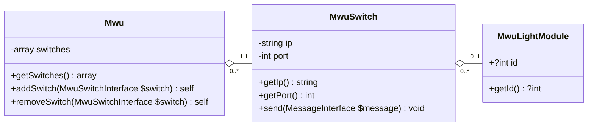

# MWU SDK

MWU SDK is a PHP library for easy communication with the [MWU Series product distributed by Pick to Light](https://web.archive.org/web/20240927094057/https://www.picktolightsystems.com/en/series-products/mwu-series).

## Compatibility

### Pick to Light specifications

The following table shows the compatibility between MWU SDK versions and the implemented TCP-IP command references provided by [Pick to Light](https://www.picktolightsystems.com).  

| MWU SDK version | Implemented TCP-IP Command Reference |
|-----------------|--------------------------------------|
| `^1.0.0`        | `6.1`                                |

### Supported languages and frameworks

This library is compatible with vanilla PHP and provides a Symfony bundle for easier integration into your projects.

| MWU SDK version | PHP compatibility | Symfony compatibility |
|-----------------|-------------------|-----------------------|
| `^1.0.0`        | `^8.2`            | `^6.4`                |

## Getting started

### Installation

To install the library in your PHP project, execute the following command:  
```shell
composer require rossel/mwu-sdk
```

#### Symfony integration

This library provides a Symfony bundle, which helps you to integrate this library to your project.  
Once the composer package installed, execute the Symfony Flex recipe, or manually create a new `mwu_sdk.yaml` configuration file under the `config/packages/` directory.

> Here is an example configuration file you can use: [config/packages/mwu_sdk.yaml](config/packages/mwu_sdk.yaml).  
> Don't forget to change the "CHANGE_ME!" values :slightly_smiling_face: !

Once done, you're all set!  

For more information about the configuration file, see [Defining a default configuration](#Defining-a-default-configuration)

#### Manual integration

You'll have to instantiate manually the `Rossel\MwuSdk\Client\Mwu\Mwu` service.  
Read the phpdoc for more information about dependencies to inject.

### Overview of most used classes

Below is a class diagram illustrating the relationships between the main classes used in the MWU SDK.  


* **MWU Service:** Entry point for communicating with the MWU pick-to-light system. It aggregates all the switches in the system.
* **MWU Switch:** Device that groups several light modules, each identified by a unique ID per switch. Each switch is accessible via a specific IP address and port.
* **MWU Light Module:** Set consisting of a screen with buttons, one of which is equipped with an LED. Each light module has a unique ID when connected to a switch.

## Defining a configuration

### Configuring Switches

Below are the options available to define the configuration of switches, in both YAML and PHP formats.

* **YAML format:**
    ```yaml
    mwu_sdk:
      switches:
        - ip_address: "144.56.46.30"
          port: 5003
          light_modules_generator:
            first_module_id: 1
            increment_between_module_ids: 1
            number_of_modules: 4
    ```

* **PHP format:**
    ```php
    $config = new \Rossel\MwuSdk\Dto\Client\DefaultConfiguration\MwuConfig(
        [
            new \Rossel\MwuSdk\Dto\Client\DefaultConfiguration\Infrastructure\SwitchConfig(
                ipAddress: '144.56.46.30',
                port: 5003,
                lightModulesGeneratorConfig: new \Rossel\MwuSdk\Dto\Client\DefaultConfiguration\Infrastructure\LightModulesGeneratorConfig(
                    firstModuleId: 1,
                    incrementBetweenModuleIds: 1,
                    numberOfModules: 4,
                )
            ),
        ],
        // ...
    );
    ```

#### Explanation of `lightModulesGeneratorConfig` Parameters

The `lightModulesGeneratorConfig` parameters define an arithmetic sequence for generating light module identifiers. The identifiers are calculated as follows:

- **Formula:**  
  

- **Initial Term:**  
  

- **Range:**  
  

This configuration generates a sequence of identifiers starting from `firstModuleId`, where each subsequent module ID is incremented by `incrementBetweenModuleIds` up to the total count specified in `numberOfModules`.

### Behavior Configuration Parameters

=========================
==== !! TO VERIFY !! ====
=========================

Each parameter in the `mwu_sdk` behavior configuration is detailed below, specifying possible values, type, default values, and descriptions.

#### `display_status.light.mode`

Controls the light's operational mode.

| Parameter | Type   | Possible Values                  | Default |
|-----------|--------|----------------------------------|---------|
| `mode`    | string | `"on"`, `"off"`, `"blink"`      | `"on"`  |

#### `display_status.light.color`

Sets the color of the light.

| Parameter | Type   | Possible Values                  | Default |
|-----------|--------|----------------------------------|---------|
| `color`   | string | `"red"`, `"green"`, `"yellow"`  | `"red"` |

#### `display_status.screen.mode`

Controls the screen's operational mode.

| Parameter | Type   | Possible Values                  | Default |
|-----------|--------|----------------------------------|---------|
| `mode`    | string | `"on"`, `"off"`                 | `"on"`  |

#### `display_status.screen.text`

Displays a custom 4-character string on screen.

| Parameter | Type   | Possible Values            | Default |
|-----------|--------|----------------------------|---------|
| `text`    | string | Any 4-character string     | `"0000"`|

---

#### `display_status_after_confirm.light.mode`

Controls the light's operational mode after confirmation.

| Parameter | Type   | Possible Values                  | Default |
|-----------|--------|----------------------------------|---------|
| `mode`    | string | `"on"`, `"off"`, `"blink"`      | `"on"`  |

#### `display_status_after_confirm.light.color`

Sets the color of the light after confirmation.

| Parameter | Type   | Possible Values                  | Default |
|-----------|--------|----------------------------------|---------|
| `color`   | string | `"red"`, `"green"`, `"yellow"`  | `"green"`|

#### `display_status_after_confirm.screen.mode`

Controls the screen's operational mode after confirmation.

| Parameter | Type   | Possible Values                  | Default |
|-----------|--------|----------------------------------|---------|
| `mode`    | string | `"on"`, `"off"`                 | `"on"`  |

#### `display_status_after_confirm.screen.text`

Displays a custom 4-character string on the screen after confirmation.

| Parameter | Type   | Possible Values            | Default |
|-----------|--------|----------------------------|---------|
| `text`    | string | Any 4-character string     | `"0000"`|

---

#### `display_status_after_fn.light.mode`

Controls the light's operational mode after "fn" action.

| Parameter | Type   | Possible Values                          | Default    |
|-----------|--------|------------------------------------------|------------|
| `mode`    | string | `"on"`, `"off"`, `"blink"`, `"fast_flash"` | `"on"`     |

#### `display_status_after_fn.light.color`

Sets the color of the light after "fn" action.

| Parameter | Type   | Possible Values                  | Default |
|-----------|--------|----------------------------------|---------|
| `color`   | string | `"red"`, `"green"`, `"yellow"`  | `"yellow"` |

#### `display_status_after_fn.screen.mode`

Controls the screen's operational mode after "fn" action.

| Parameter | Type   | Possible Values                  | Default |
|-----------|--------|----------------------------------|---------|
| `mode`    | string | `"on"`, `"off"`                 | `"on"`  |

#### `display_status_after_fn.screen.text`

Displays a custom 4-character string on screen after "fn" action.

| Parameter | Type   | Possible Values            | Default |
|-----------|--------|----------------------------|---------|
| `text`    | string | Any 4-character string     | `"9999"`|

---

#### `buttons.fn.text`

Custom text shown on "fn" button display.

| Parameter | Type   | Possible Values            | Default |
|-----------|--------|----------------------------|---------|
| `text`    | string | Any 4-character string     | `"----"`|

#### `buttons.quantity_keys.mode`

Sets behavior for the quantity keys.

| Parameter | Type   | Possible Values                  | Default      |
|-----------|--------|----------------------------------|--------------|
| `mode`    | string | `"increment"`, `"decrement"`, `"off"` | `"increment"` |

## Sending a Command

This section outlines the process of sending commands within the MWU system.
Commands can be issued from switches, light modules, or the MWU service, allowing flexible control over the system's operations.

### `Write` command

The write command allows you to send text or data instructions to individual or multiple light modules within the MWU system.
It provides configuration options to customize the light's appearance, such as color and display mode, facilitating communication and signaling in pick-to-light applications.

#### Write text on an individual light module

```php
use MwuSdk\Builder\Command\Write\WriteCommandBuilder;use MwuSdk\Client\MwuLightModule\MwuLightModuleInterface;use MwuSdk\Enum\ConfigurationParameterValues\Display\LightColor;use MwuSdk\Enum\ConfigurationParameterValues\Display\LightMode;use MwuSdk\Factory\Entity\Command\Client\Write\WriteCommandModeArrayFactory;

class MyClass {
    public function __construct(
        private WriteCommandModeArrayFactory $writeCommandModeArrayFactory,
    ) {
    }

    public function myFunction(
        MwuLightModuleInterface $lightModule,
    ): void {
        $commandBuilder = new WriteCommandBuilder($this->writeCommandModeArrayFactory);
        
        // Optional: Configure the builder as you want, so that the generated commands follow these specifications.
        $commandBuilder
            ->withLightColor(LightColor::RED)
            ->withLightMode(LightMode::FLASH);
            
        // Send a "write" instruction to the light module.
        $lightModule->write($commandBuilder, '0001');
    }
}
```

#### Write text on multiple light modules, from a specific switch

```php
use MwuSdk\Builder\Command\Write\WriteCommandBuilder;use MwuSdk\Client\MwuSwitch\MwuSwitchInterface;use MwuSdk\Enum\ConfigurationParameterValues\Display\LightColor;use MwuSdk\Enum\ConfigurationParameterValues\Display\LightMode;use MwuSdk\Factory\Entity\Command\Client\Write\WriteCommandModeArrayFactory;

class MyClass {
    public function __construct(
        private WriteCommandModeArrayFactory $writeCommandModeArrayFactory,
    ) {
    }

    public function myFunction(
        MwuSwitchInterface $switch,
    ): void {
        $commandBuilder = new WriteCommandBuilder($this->writeCommandModeArrayFactory);
        
        // Optional: Configure the builder as you want, so that the generated commands follow these specifications.
        $commandBuilder
            ->withLightColor(LightColor::RED)
            ->withLightMode(LightMode::FLASH);
            
        // Method 1: Send a "write" instruction to the specified light modules connected to the switch.
        $switch->write(
            $switch->getLightModulesByIds([1, 2, 3])
            $commandBuilder,
            '0001',
        );
        
        // Method 2: Send a "write" instruction to all the light modules connected to the switch.
        $switch->broadcastWrite($commandBuilder, '0001');
    }
}
```

#### Write text on light modules of multiple switches

```php
class MwuService extends \MwuSdk\Client\Mwu\Mwu {
}
```

```php
use MwuSdk\Builder\Command\Write\WriteCommandBuilder;use MwuSdk\Client\Mwu\MwuServiceInterface;use MwuSdk\Enum\ConfigurationParameterValues\Display\LightColor;use MwuSdk\Enum\ConfigurationParameterValues\Display\LightMode;use MwuSdk\Factory\Entity\Command\Client\Write\WriteCommandModeArrayFactory;

class MyClass {
    public function __construct(
        private WriteCommandModeArrayFactory $writeCommandModeArrayFactory,
    ) {
    }

    public function myFunction(
        MwuServiceInterface $mwuService
    ): void {
        $commandBuilder = new WriteCommandBuilder($this->writeCommandModeArrayFactory);
        
        // Optional: Configure the builder as you want, so that the generated commands follow these specifications.
        $commandBuilder
            ->withLightColor(LightColor::RED)
            ->withLightMode(LightMode::FLASH);
            
        // Method 1: Send a "write" instruction to all light modules connected to the specified switches.
        $mwuService->write(
            [
                $mwu->getSwitchById(0),
                $mwu->getSwitchById(1),
            ],
            $commandBuilder,
            '0001'
        );
        
        // Method 2: Send a "write" instruction to all light modules of all connected switches.
        $mwuService->broadcastWrite($commandBuilder, $commandBuilder, '0001');
    }
}
```
