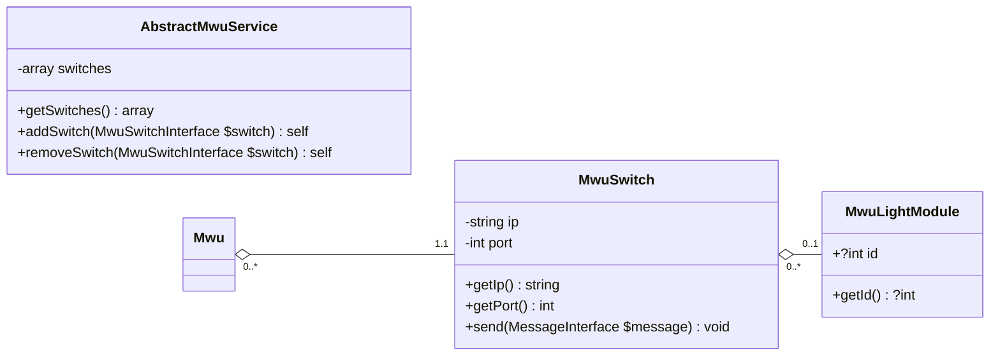

# MWU SDK

MWU SDK is a PHP library for easy communication with the [MWU Series product distributed by Pick to Light](https://web.archive.org/web/20240927094057/https://www.picktolightsystems.com/en/series-products/mwu-series).

## Compatibility

### Pick to Light specifications

The following table shows the compatibility between MWU SDK versions and the implemented TCP-IP command references provided by [Pick to Light](https://www.picktolightsystems.com).  

| MWU SDK version | Implemented TCP-IP Command Reference |
|-----------------|--------------------------------------|
| `^1.0.0`        | `6.1`                                |

### Supported languages and frameworks

This library is compatible with vanilla PHP and provides a Symfony bundle for easier integration into your projects.

| MWU SDK version | PHP compatibility | Symfony compatibility |
|-----------------|-------------------|-----------------------|
| `^1.0.0`        | `^8.2`            | `^6.4`                |

## Getting started

### Overview of most used classes

Below is a class diagram illustrating the relationships between the main classes used in the MWU SDK.  


* **MWU Service:** Entry point for communicating with the MWU pick-to-light system. It aggregates all the switches in the system.
* **MWU Switch:** Device that groups several light modules, each identified by a unique ID per switch. Each switch is accessible via a specific IP address and port.
* **MWU Light Module:** Set consisting of a screen with buttons, one of which is equipped with an LED. Each light module has a unique ID when connected to a switch.

### Mwu service creation

First, you can create a service to group switches in one place, allowing easy retrieval later.  
To do so, extend the `\MwuSdk\Client\AbstractMwu` class, which provides a ready-to-use MWU client.

```php
class MwuService extends \MwuSdk\Client\MwuService {
}
```
> **Note:** To prevent resetting the communication between your application and the MWU system, it's essential to always use the same instance of the service.  
> In Symfony, this can be achieved by configuring the class as a [shared service](https://symfony.com/doc/current/service_container/shared.html), ensuring that the same instance is reused throughout your application.

Once the service is created, you can add your switches :  
* manually, with the `addSwitch(MwuSwitchInterface $switch)` method;
* by loading a configuration object, with the `loadConfiguration(MwuConfigInterface $config)` method;
* by loading a YAML configuration file, with the `loadYamlConfigurationFile(string $path)` method.

### Defining a default configuration

#### YAML configuration file

##### Example of complete configuration

Below is an example of a complete YAML configuration for setting up your MWU Service.

```yaml
mwu_default_config:
  switches:
    - ip_address: "144.56.46.30"
      port: 5003
      light_modules_generator:
        first_module_id: 1
        increment_between_module_ids: 1
        number_of_modules: 4
    - ip_address: "144.56.46.31"
      port: 5003
      light_modules_generator:
        first_module_id: 1
        increment_between_module_ids: 1
        number_of_modules: 4
  behavior:
    display_status:
      light:
        mode: on
        color: yellow
      screen:
        mode: on
        text: 0000
    display_status_after_confirm:
      light:
        mode: on
        color: green
      screen:
        mode: on
        text: 0000
    display_status_after_fn:
      light:
        mode: fast_flash
        color: red
      screen:
        mode: on
        text: 9999
    buttons:
      confirm:
        enabled: true
      fn:
        enabled: true
        text: ----
        used_as_decrement: false
      quantity_keys:
        mode: off
```

##### Retrieving the YAML configuration

To configure your MWU Service using a YAML file, you can simply call `AbstractMwuService::loadYamlConfig(string $path)` with the path to your file.

### Sending a Command

This section outlines the process of sending commands within the MWU system.
Commands can be issued from switches, light modules, or the MWU service, allowing flexible control over the system's operations.

#### `Write` command

The write command allows you to send text or data instructions to individual or multiple light modules within the MWU system.
It provides configuration options to customize the light's appearance, such as color and display mode, facilitating communication and signaling in pick-to-light applications.

##### Write text on an individual light module

```php
use MwuSdk\Builder\Command\Write\WriteCommandBuilder;
use MwuSdk\Client\MwuLightModuleInterface;
use MwuSdk\Enum\ConfigurationParameterValues\Display\LightColor;
use MwuSdk\Enum\ConfigurationParameterValues\Display\LightMode;
use MwuSdk\Factory\Dto\Command\Write\WriteCommandModeArrayFactory;

class MyClass {
    public function __construct(
        private WriteCommandModeArrayFactory $writeCommandModeArrayFactory,
    ) {
    }

    public function myFunction(
        MwuLightModuleInterface $lightModule,
    ): void {
        $commandBuilder = new WriteCommandBuilder($this->writeCommandModeArrayFactory);
        
        // Optional: Configure the builder as you want, so that the generated commands follow these specifications.
        $commandBuilder
            ->withLightColor(LightColor::RED)
            ->withLightMode(LightMode::FLASH);
            
        // Send a "write" instruction to the light module.
        $lightModule->write($commandBuilder, '0001');
    }
}
```

##### Write text on multiple light modules, from a specific switch

```php
use MwuSdk\Builder\Command\Write\WriteCommandBuilder;
use MwuSdk\Client\MwuSwitchInterface;
use MwuSdk\Enum\ConfigurationParameterValues\Display\LightColor;
use MwuSdk\Enum\ConfigurationParameterValues\Display\LightMode;
use MwuSdk\Factory\Dto\Command\Write\WriteCommandModeArrayFactory;

class MyClass {
    public function __construct(
        private WriteCommandModeArrayFactory $writeCommandModeArrayFactory,
    ) {
    }

    public function myFunction(
        MwuSwitchInterface $switch,
    ): void {
        $commandBuilder = new WriteCommandBuilder($this->writeCommandModeArrayFactory);
        
        // Optional: Configure the builder as you want, so that the generated commands follow these specifications.
        $commandBuilder
            ->withLightColor(LightColor::RED)
            ->withLightMode(LightMode::FLASH);
            
        // Method 1: Send a "write" instruction to the specified light modules connected to the switch.
        $switch->write(
            $switch->getLightModulesByIds([1, 2, 3])
            $commandBuilder,
            '0001',
        );
        
        // Method 2: Send a "write" instruction to all the light modules connected to the switch.
        $switch->broadcastWrite($commandBuilder, '0001');
    }
}
```

##### Write text on light modules of multiple switches

```php
class MwuService extends \MwuSdk\Client\MwuService {
}
```

```php
use MwuSdk\Builder\Command\Write\WriteCommandBuilder;
use MwuSdk\Client\MwuServiceInterface;
use MwuSdk\Enum\ConfigurationParameterValues\Display\LightColor;
use MwuSdk\Enum\ConfigurationParameterValues\Display\LightMode;
use MwuSdk\Factory\Dto\Command\Write\WriteCommandModeArrayFactory;

class MyClass {
    public function __construct(
        private WriteCommandModeArrayFactory $writeCommandModeArrayFactory,
    ) {
    }

    public function myFunction(
        MwuServiceInterface $mwuService
    ): void {
        $commandBuilder = new WriteCommandBuilder($this->writeCommandModeArrayFactory);
        
        // Optional: Configure the builder as you want, so that the generated commands follow these specifications.
        $commandBuilder
            ->withLightColor(LightColor::RED)
            ->withLightMode(LightMode::FLASH);
            
        // Method 1: Send a "write" instruction to all light modules connected to the specified switches.
        $mwuService->write(
            [
                $mwu->getSwitchById(0),
                $mwu->getSwitchById(1),
            ],
            $commandBuilder,
            '0001'
        );
        
        // Method 2: Send a "write" instruction to all light modules of all connected switches.
        $mwuService->broadcastWrite($commandBuilder, $commandBuilder, '0001');
    }
}
```
